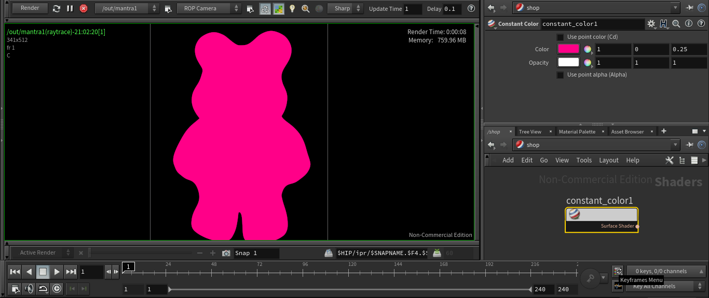

# Constant Color

A simple pure shaded color.

***Parameters***
- **Use point color (Cd)**: If true, overlaps color with geometry attribute *Cd*.
- **Color**: Output color.
- **Opacity**: Sets the opacity of the shader.
- **Use point alpha (Alpha)**: If true, uses the geometry attribute *Alpha*.

Installation: *File > Import > Houdini Digial Asset... > ../path/file.hdanc*