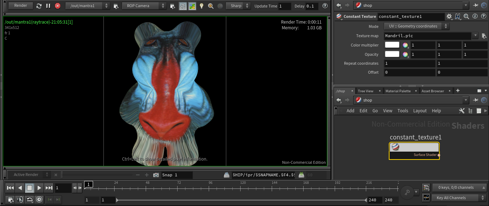

# Constant Texture

A simple pure shaded color from texture.

***Parameters***
- **Mode**: Selects the coordinate format.
    + **UV**: Geometry coordinates.
    + **ST**: Primitive coordinates.
- **Texture map**: The image file to use as a texture map.
- **Color multiplier**: Multiplies the color from texture.
- **Opacity**: Sets the opacity of the shader.
- **Repeat coordinates**: Controls how many times the basic texture is repeated (tiled) within the texture.
- **Offset**: Controls the position of the texture tiles within the texture.

Installation: *File > Import > Houdini Digial Asset... > ../path/file.hdanc*