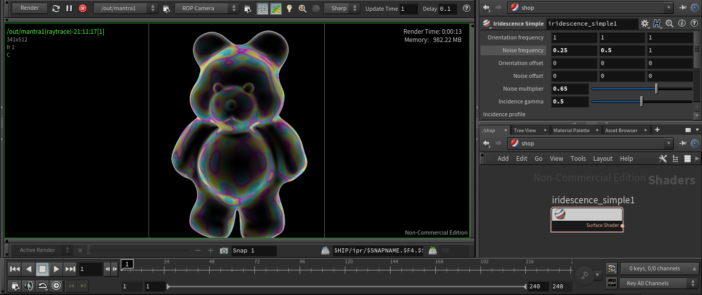

# Iridescence Simple

A simple iridescent shader.

***Parameters***
- **Orientation frequency**: Frequency of iridescent orientantion part.
- **Noise frequency**: Frequency of iridescent noise part.
- **Orientation offset**: Offset of iridescent orientantion part.
- **Nose offset**: Offset of iridescent noise part.
- **Noise multiplier**: Controls the intensity of noise.
- **Incidence gamma**: Gamma correction applied to incidence value (fr).
- **Incidence profile**: Incident distribution curve control, applied after gamma correction.

Installation: *File > Import > Houdini Digial Asset... > ../path/file.hdanc*