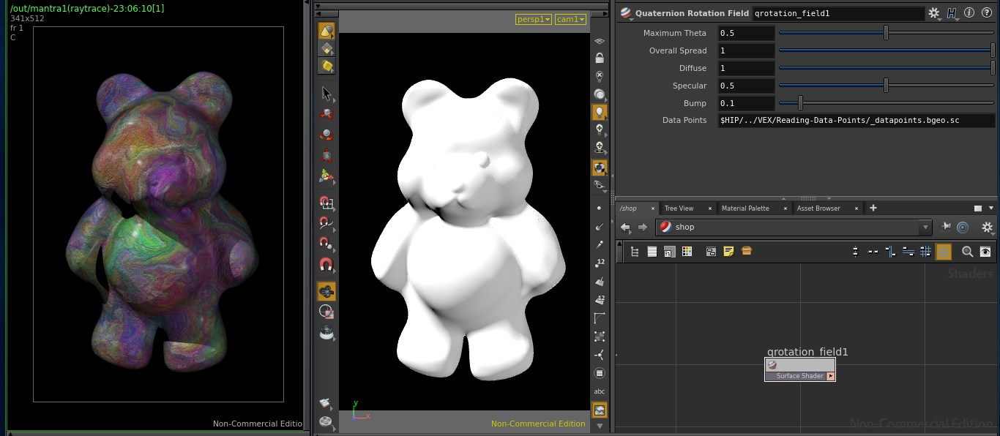
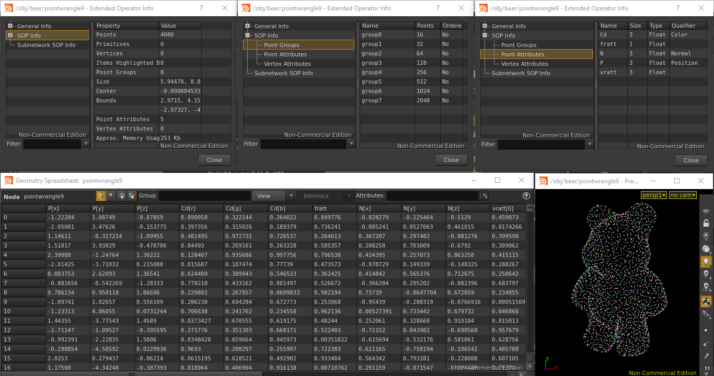
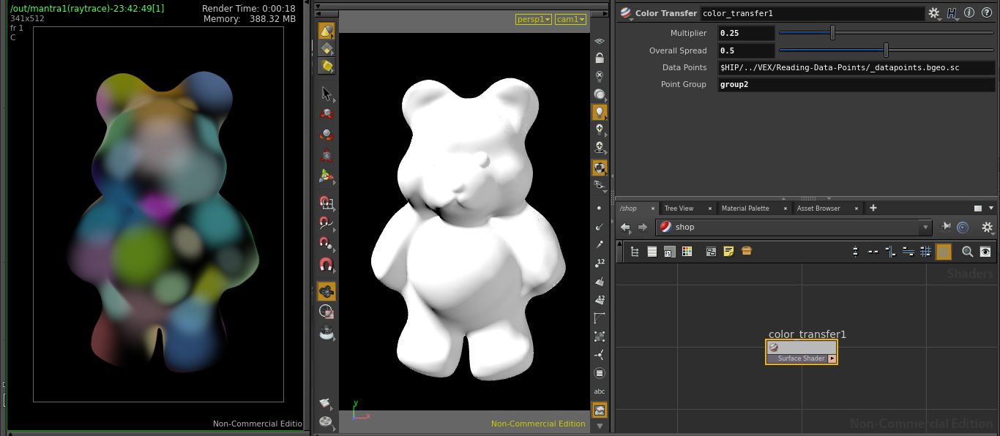

# Reading Data Points

Reading data points and attributes from *bgeo* files and bringing into shaders for whichever purpose.

Installation: *File > Import > Houdini Digial Asset... > ../path/file.hdanc*